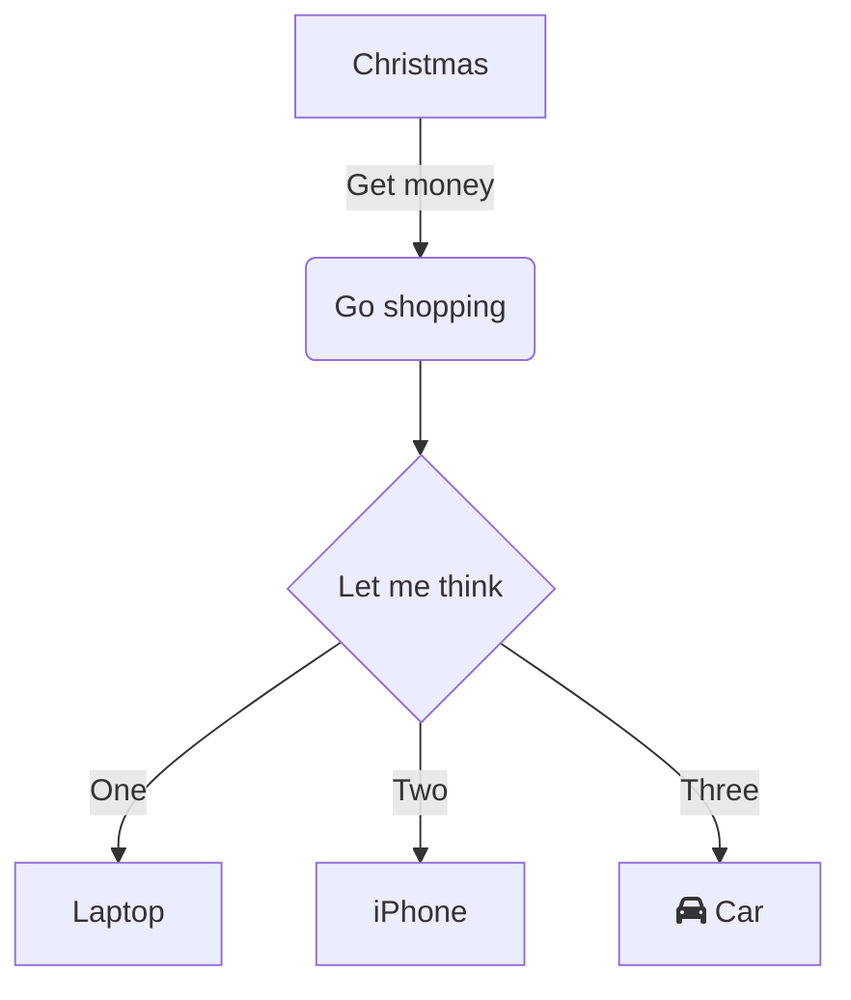
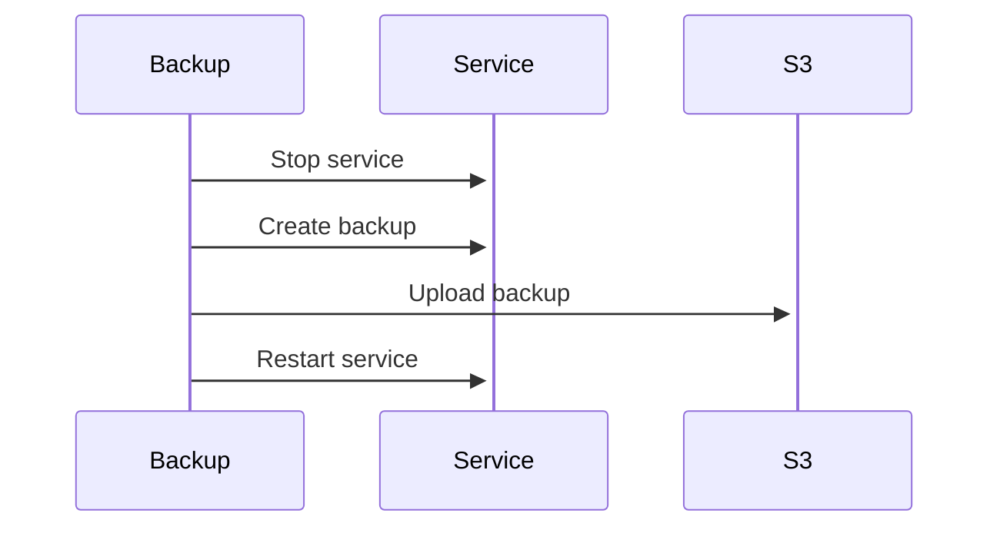
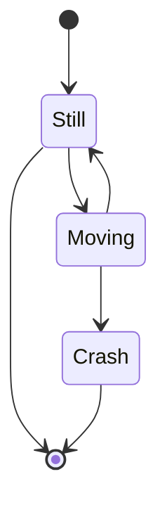

# UML

**Unified Modeling Language** (**UML**) is a set of different diagrams for
visualizing software systems. The diagrams are divided into structural and
behavioral. Although UML diagrams are handy for visualizing various aspects of a
software system, there is no standard for how a system should be visualized
(which is in contrast to [C4](./c4.md)).

## Flow diagram

A **flow diagram** describes a flow.

## Sequence diagram

A **sequence diagram** describes the flow of a sequence, for example a login
flow.

## State diagram

A **state diagram** visualizes the possible states of an entity.

