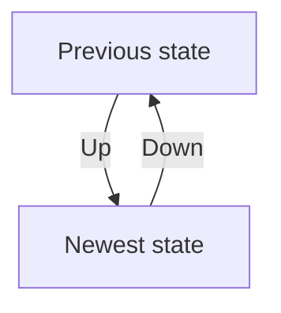

# Migrations

**Database migrations** happens when one needs to import data or alter the
schema of an already existing database.

## Schema alteration

Schema alterations typically happens in conjunction with deploying new versions
of the software. One approach is to view the database schemas as a state machine
and database migrations as transitioning between different states. For each
needed transition, one creates a migration script that contains the necessary
commands for executing the state change.



Although the migration scripts typically are written in an [ORM](../orm.md),
here is an example in SQL. Assume we initially created a table like so:

```sql
-- Create initial table
CREATE TABLE Persons (
  Id int,
  Name varchar(255),
  Address varchar(255)
);
```

Assume, that the need arise to specify last and first name. Then the following
can be a suitable migration script:

```sql
-- Add last name to Persons table
ALTER TABLE Persons
ADD LastName varchar(255);

-- Rename name to first name
ALTER TABLE Persons
RENAME COLUMN Name TO FirstName;
```

This obviously has problems with that all names are assumed to be first names,
but never the less illustrates the idea. We typically also want the possibility
of performing the opposite transition (downgrading). An example of this would be

```sql
-- Remove last name from Persons table
ALTER TABLE Persons
DROP COLUMN LastName;

-- Rename first name to name
ALTER TABLE Persons
RENAME COLUMN FirstName TO Name;
```

## Importing data

Sometimes data needs to be imported into the database, for example if syncing to
an external system. This can cause performance issues, especially when handling
big data.

If downtime is allowed, it can be faster to disable constraints on integrity
while importing data and later rebuilding it.
